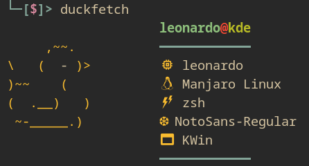

<h1>duckfetch<h1>
<hr>

## welcome to duckfetch! 🦆

the project is a WIP, if you contribute i will be happy c:

### installation ✏
  
```
git clone https://github.com/justleoo/duckfetch
cd duckfetch
chmod +x ./install
./install
duckfetch
```
  
done! use `duckfetch` command.

### showcase 



### on android (termux) by [Guaxinim5573](https://github.com/Guaxinim5573)


